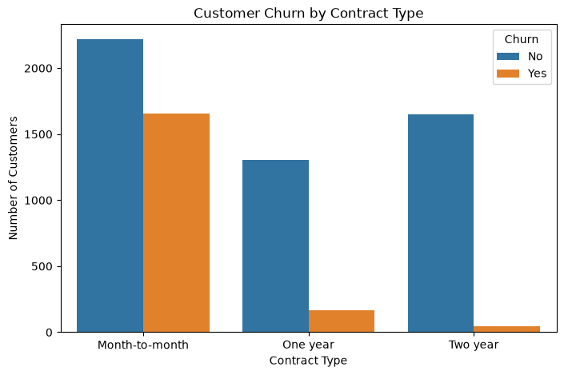
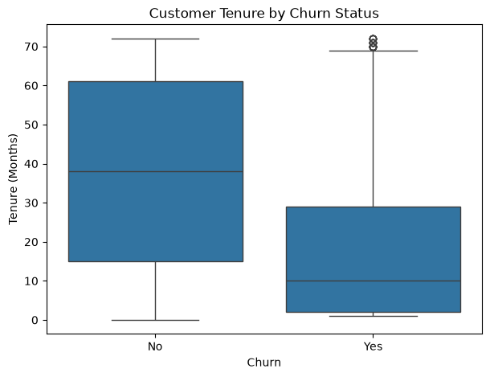
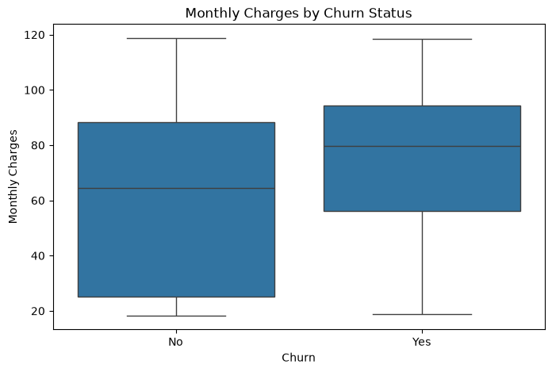
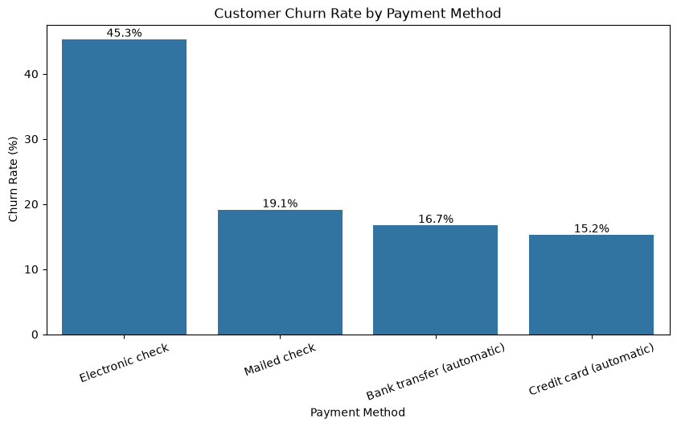
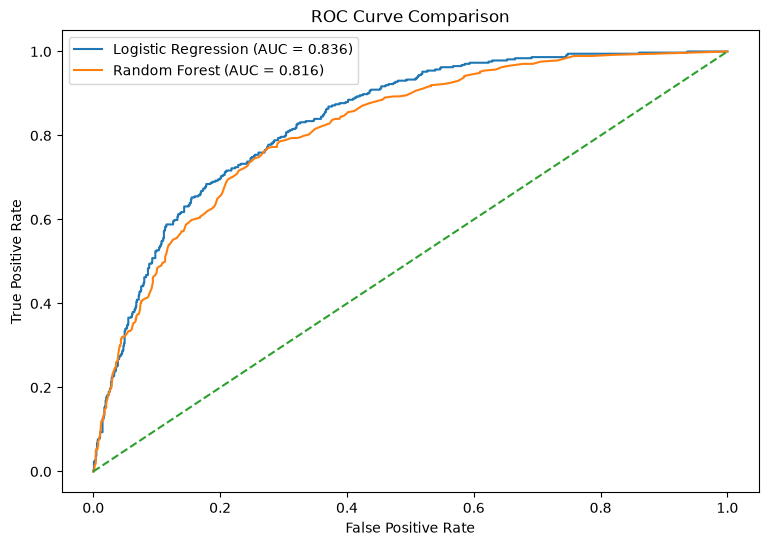

# Customer Churn Prediction & Retention Prioritization

An end-to-end machine learning project that predicts customer churn,
identifies high-risk customers, and supports targeted customer-retention
decisions.
## Project Overview

Customer churn is a major business problem because losing existing customers
can reduce recurring revenue and increase the resources required to acquire
new customers.

This project develops an end-to-end machine learning solution for predicting
which customers are more likely to churn. The analysis combines exploratory
data analysis, feature preprocessing, machine learning, model evaluation,
classification-threshold optimization, and customer-level risk segmentation.

The final solution uses Logistic Regression to generate churn probabilities
and applies an optimized classification threshold of 0.40 to identify
customers who may require retention attention.

The project goes beyond model prediction by translating the results into
customer risk segments and potential business actions.

## Business Problem

A telecommunications company is experiencing customer churn and wants to
identify customers who are at higher risk of leaving.

Without a predictive approach, the company may rely on broad retention
campaigns that treat all customers similarly.

The business needs a way to:

- Identify customers who are likely to churn.
- Understand characteristics associated with churn.
- Prioritize customers for retention efforts.
- Allocate retention resources more efficiently.
- Support proactive rather than reactive customer engagement.

## Project Objective

The objective of this project is to develop a binary classification model that
predicts customer churn and converts the predictions into actionable customer
risk segments.

The project aims to:

1. Explore the factors associated with customer churn.
2. Build and compare multiple classification models.
3. Evaluate model performance using appropriate classification metrics.
4. Optimize the classification threshold for the retention use case.
5. Generate customer-level churn probabilities.
6. Segment customers according to their predicted churn risk.
7. Translate the model findings into potential retention strategies.

## Dataset

The project uses the IBM Telco Customer Churn dataset.

The dataset contains customer demographic, account, service, and billing
information. The target variable is `Churn`, which indicates whether a
customer left the company.

Key variables include:

- Customer tenure
- Contract type
- Internet service
- Monthly charges
- Total charges
- Payment method
- Online security
- Technical support
- Streaming services
- Customer demographics

### Dataset Source

The dataset was obtained from the publicly available Telco Customer Churn
dataset.

[Kaggle Dataset](https://www.kaggle.com/datasets/blastchar/telco-customer-churn)

## Business Questions

The analysis was designed to answer several business questions:

- Which customer characteristics are associated with higher churn?
- Which customer segments present greater churn risk?
- Can machine learning reliably distinguish customers who churn from those
  who remain?
- Which model provides the most useful predictive performance?
- How can churn probabilities be converted into actionable customer-risk
  segments?
- How can the business prioritize limited retention resources?

## Methodology

The project followed an end-to-end data science workflow:

1. Data loading and inspection
2. Data cleaning and preprocessing
3. Exploratory data analysis
4. Feature preparation
5. Train-test splitting
6. Feature scaling and categorical encoding
7. Model development
8. Hyperparameter tuning
9. Model evaluation
10. Classification-threshold optimization
11. Customer-level risk scoring
12. Business interpretation

## Exploratory Data Analysis

Exploratory analysis was performed to understand patterns associated with
customer churn.

Important findings included:

- Month-to-month customers showed considerably higher churn than customers
  on longer-term contracts.
- Customers with shorter tenure generally showed greater churn risk.
- Monthly charges differed across churn outcomes.
- Payment method was associated with different levels of churn.
- Internet service type showed differences in churn behavior.
- Customers without services such as online security and technical support
  showed different churn patterns.
- Interactions between contract type, tenure, monthly charges, and internet
  service revealed additional high-risk customer profiles.

These findings were used to guide the subsequent predictive modeling stage.

## Machine Learning

Two classification algorithms were developed and evaluated:

- Logistic Regression
- Random Forest

A preprocessing pipeline was used to:

- Standardize numerical features.
- One-hot encode categorical features.
- Handle previously unseen categorical values.

Hyperparameter tuning was also performed using `GridSearchCV`.

Logistic Regression achieved the strongest overall performance among the
models evaluated and was selected as the final model.

## Model Evaluation

The models were evaluated using accuracy, precision, recall, F1-score, and
ROC-AUC.

| Model | Accuracy | Precision | Recall | F1-score | ROC-AUC |
|---|---:|---:|---:|---:|---:|
| Logistic Regression | 80.45% | 64.95% | 57.49% | 60.99% | 83.59% |
| Random Forest | 78.39% | 61.51% | 50.00% | 55.16% | 81.58% |

Logistic Regression produced the strongest overall results among the models
tested and was therefore selected as the final predictive model.

## Classification Threshold Optimization

The default classification threshold of 0.50 was not automatically assumed to
be optimal for the business problem.

Multiple thresholds were evaluated to determine how the trade-off between
precision and recall affected the identification of potential churners.

A threshold of **0.40** produced the highest F1-score among the tested
thresholds.

| Threshold | Precision | Recall | F1-score |
|---:|---:|---:|---:|
| 0.30 | 51.2% | 75.9% | 61.1% |
| 0.35 | 54.4% | 71.9% | 62.0% |
| **0.40** | **57.9%** | **68.4%** | **62.7%** |
| 0.45 | 60.4% | 63.1% | 61.7% |
| 0.50 | 65.0% | 57.5% | 61.0% |

The final solution therefore uses a classification threshold of **0.40**.

This increases recall compared with the default threshold, allowing the
business to identify a larger proportion of customers who may eventually
churn.

## Customer Risk Segmentation

The final model was used to generate customer-level churn probabilities.

Customers were classified into three risk categories:

| Risk Level | Customers | Percentage |
|---|---:|---:|
| High Risk | 83 | 5.9% |
| Medium Risk | 359 | 25.5% |
| Low Risk | 965 | 68.6% |
| **Total** | **1,407** | **100%** |

The model therefore identified **442 customers** as having at least medium
churn risk.

This segmentation provides a practical way for a business to prioritize
retention resources rather than applying the same intervention to every
customer.

## Key Business Findings

The model and exploratory analysis identified several important churn signals.

### Customer Tenure

Tenure was the strongest feature by absolute Logistic Regression coefficient,
with a coefficient of **-1.350**.

Shorter-tenure customers generally showed higher predicted churn risk.

### Contract Type

Month-to-month contracts had a positive coefficient of **+0.624**, while
two-year contracts had a coefficient of **-0.772**.

Contract structure therefore provides important information for identifying
customers at different levels of churn risk.

### Internet Service

Fiber-optic service had a coefficient of **+0.592**, while DSL had a
coefficient of **-0.602** relative to the model's reference category.

This indicates different predicted churn levels across internet-service
segments.

### Monthly Charges

Monthly charges were also an important numerical predictor. The standardized
coefficient was **-0.530**.

Because monthly charges interact with other customer characteristics, this
relationship should not be interpreted as causal.

### Payment Method

Electronic-check customers had a positive coefficient of **+0.188**, making
payment method another useful predictive signal.

### Additional Services

Several service variables also contributed to prediction:

- Streaming TV: **+0.198**
- Streaming Movies: **+0.184**
- Online Security — No: **+0.174**
- Tech Support — No: **+0.151**

## Business Recommendations

Based on the analysis, a practical retention strategy could include:

### 1. Prioritize High-Risk Customers

Customers with high predicted churn probabilities should receive the highest
level of retention attention.

### 2. Focus on Early-Tenure Customers

Newer customers could receive stronger onboarding, proactive engagement, and
early-stage retention programs.

### 3. Investigate Month-to-Month Customers

High-risk month-to-month customers could be considered for loyalty benefits,
contract-conversion incentives, or targeted retention campaigns.

### 4. Investigate Service-Related Risk

The company should investigate whether service quality, technical support,
pricing, or customer experience contributes to churn among higher-risk
internet-service segments.

### 5. Investigate Payment Friction

The relationship between payment method and churn should be investigated for
potential billing or payment-experience issues.

### 6. Measure Retention Outcomes

Retention interventions should be evaluated using controlled experiments or
other appropriate measurement approaches to determine whether they actually
reduce churn.

## Limitations

- The dataset is publicly available and may not represent the behavior of a
  specific real-world company's customers.
- Predictive relationships do not establish causation.
- The dataset does not contain richer behavioral information such as customer
  complaints, support interactions, service outages, or customer satisfaction.
- The Retention Priority Score is an illustrative prioritization method and
  is not a formal Customer Lifetime Value calculation.
- The classification threshold should be recalibrated according to the
  economics and operational costs of a real business.
- A production model would require continuous monitoring and retraining as
  customer behavior changes.

  ## Technologies Used

- Python
- Pandas
- NumPy
- Matplotlib
- Seaborn
- Scikit-learn
- Jupyter Notebook
- Joblib
- Git & GitHub

## Project Structure

```text
customer-churn-prediction/
│
├── data/
│   └── README.md
│
├── models/
│   └── final_churn_model.pkl
│
├── notebooks/
│   └── 01_churn_analysis.ipynb
│
├── src/
│   └── README.md
│
├── .gitignore
├── README.md
└── requirements.txt


---

# Step 19 — How to Run

```markdown
## How to Run

### 1. Clone the repository

```bash
git clone <YOUR_GITHUB_REPOSITORY_URL>
cd customer_churn_prediction

## Key Visualizations

### Customer Churn Distribution


### Churn by Contract Type



### Tenure and Churn



### Monthly Charges and Churn



### Churn by Payment Method



### Model Performance

